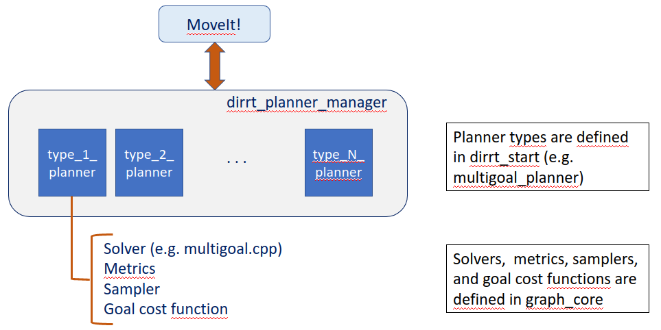
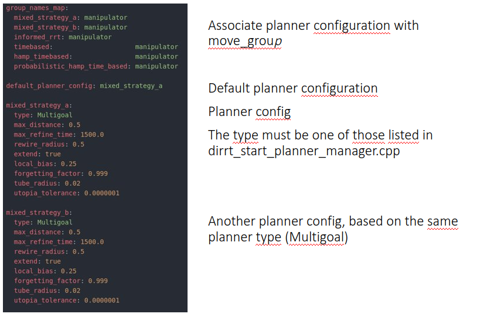

This package provides a ROS/C++ library with advanced path planners for robot manipulators. The library allows for fast design and deployment of MoveIt!-compatible path planners. Ad-hoc cost functions, metrics, sampling strategies can be designed. Some of them (e.g., minimum-path metrics, human-aware metrics, informed sampling, mixed informed sampling) are already available.

## Index

1. [Installation](#installation)
2. [Configuration](#configuration)
3. [Concept](#concept)
4. [References](#references)
5. [Acknowledgments](#ack)

## Installation <a name="installation"></a>

The software can be installed using rosinstall files.

1. Install ros: follow the steps described in http://wiki.ros.org/ROS/Installation
2. Install wstool and initialize the workspace: follow the steps described in http://wiki.ros.org/wstool
3. Install and configure rosdep: follow the steps described in http://wiki.ros.org/rosdep

Then, download and merge the rosinstall file:
```
cd ~/catkin_ws
wget https://raw.githubusercontent.com/JRL-CARI-CNR-UNIBS/cari_motion_planning/master/human_aware.rosinstall
wstool merge -t src ./human_aware.rosinstall
```
Now, do the same with the required dependencies:
```
cd ~/catkin_ws
wget https://raw.githubusercontent.com/CNR-STIIMA-IRAS/rosdyn/master/rosdyn.rosinstall
wstool merge -t src ./rosdyn.rosinstall
```
Download and install the packages specified in the rosinstall file and the other system dipendencies:
```
cd ~/catkin_ws
wstool update -t src
rosdep install --from-paths src --ignore-src -r -y
```
## Configuration <a name="configuration"></a>

See [readme](dirrt_star/readme.md) in dirrt_star.

## Concept <a name="concept"></a>

The repository contains two main packages:

- dirrt_start: it contains dirrt_start_planner_manager, which acts as interface between the motion planner and MoveIt!, and it defines planner types (e.g. multigoal_planner), which are the actual motion planners classes.
- graph_core: it contains the basic classes for nodes, trees, paths and the definition of solvers, collision checkers, samplers, metrics, and cost functions.



### dirrt_start_planner_manager

It is the interface between MoveIt! and the motion planner.

MoveIt! requests a planning through the getPlanningContext method. The planner manager returns a pointer to the planner, which will be used by MoveIt!

It contains the method "initialize", which reads setting parameters from ROS param. The setting params are defined in the file dirrt_planning.yaml in the foo_moveit_config package of your cell.

The method initialize expects to find params that define the planner configuration. The planner configurations defined in dirrt_planning.yaml must have a type that corresponds to one of the types expected in the method initialize (e.g. Multigoal, TimeBasedMultigoal, HAMPTimeBasedMultigoal)

The planner types are defined in dirrt_star. E.g. in multigoal_planner, time_planner

### Planner types

Planner types are defined in dirrt_star. Example are multigoal_planner, time_planner.

Note: planner types should be limited. Before creating a new planner type check whether you can achieve the same result by changing parameters of existing planner types.

Example 1: two different configurations of the same planner type (Multigoal) are created in the picture below. By tuning the parameters of the planners differently, it is possible to achieve different planning performance.



Example 2: a human-aware planner with cost function along the whole path or only on the goal configuration can be created by enabling or disabling the parameters avoidance_path and avoidance_goal

### An example: the multigoal planner type

Consider the class multigoal_planner from the package dirrt_start. The class has a constructor that load the params from dirrt_planning.yaml (package foo_moveit_config).

The class has a method "solve" that will be called by MoveIt to solve the planning query.

"solve" has the following main steps:

- It creates the planning_scene
- It creates the collision checker
- It creates the sampler (initialized to upper and lower bound of the joints)
- It creates a solver, which is instatiated by a metric, a collision checker, and a sampler
- It runs the solver until the query is solved

When the solver is created, it requires a metric, a collision checker, and a sampler. The types of available solvers are in graph_core/solvers. The types of metrics, checkers, and samplers are defined in graph_core.

### Solvers

Solvers are defined in graph_core/solvers (e.g. multigoal). All solvers are derived from the class TreeSolve. The main methods of a solver are:

- config: it loads the param from dirrt_planning.yaml
- update: it runs one iteration of the solver. Here there is the mixed sampling strategy
- add_start: it iniatilizes the tree
- add_goal: it adds goals to the tree

### Metrics

Metrics define the cost function along the path that the solver will have to minimize.
All metrics are defined in graph_core and are derived from the class metrics.

### Goal cost functions

Goal cost functions are terminal goals assigned only to the goal configurations.
All cost functions are defined in graph_core and are derived from the class goal_cost_function.

## References <a name="references"></a>

If you wish to use this code please cite one of the following publications:

- for asymptotically optimal path planners:
```
@article{faroni2022accelerating,
  title={Accelerating sampling-based optimal path planning via adaptive informed sampling},
  author={Faroni, Marco and Pedrocchi, Nicola and Beschi, Manuel},
  journal={arXiv preprint arXiv:2208.09318},
  year={2022}
}
```
Available at https://arxiv.org/pdf/2208.09318.pdf

- human-aware path planning:
```
@article{faroni2022safety,
  title={Safety-aware time-optimal motion planning with uncertain human state estimation},
  author={Faroni, Marco and Beschi, Manuel and Pedrocchi, Nicola},
  journal={IEEE Robotics and Automation Letters},
  volume={7},
  number={4},
  pages={12219--12226},
  year={2022},
  publisher={IEEE}
}
```
Available at https://arxiv.org/pdf/2210.11655.pdf

## Ack <a name="ack"></a>

This work was partially supported by ShareWork project (H2020, European Commission – G.A.820807) and Pickplace project (H2020, European Commission – G.A.780488).
